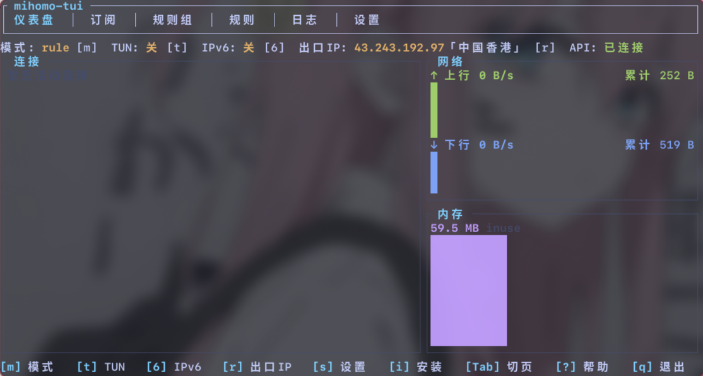
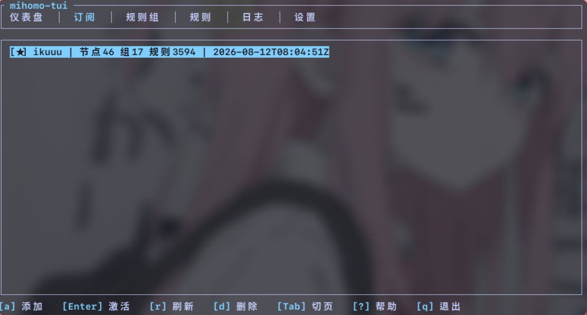
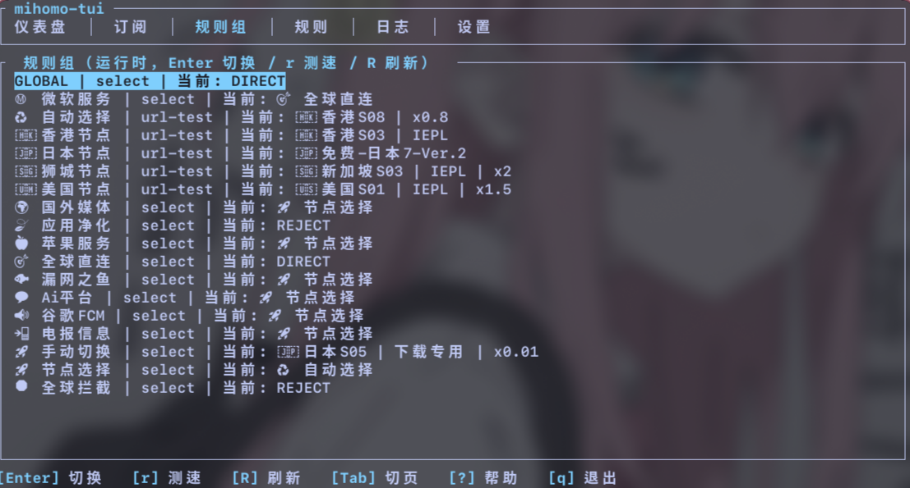
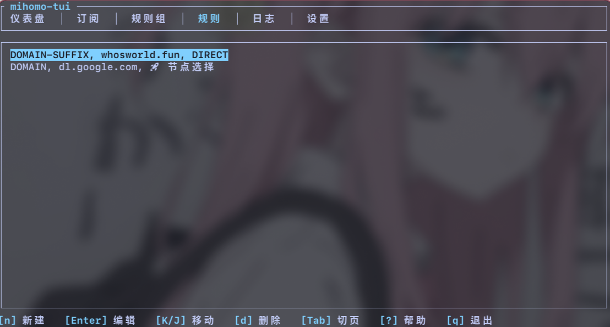
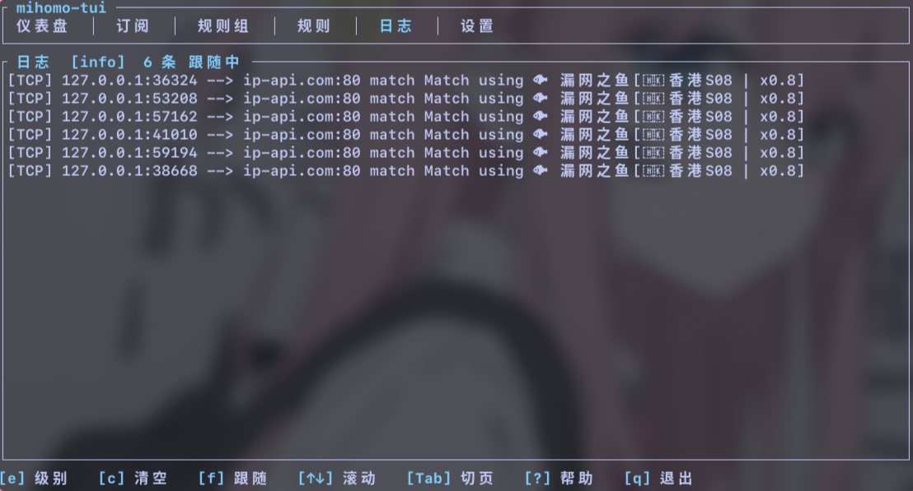

# clash-tui

Linux 下的 [mihomo](https://github.com/MetaCubeX/mihomo)（Clash Meta 内核）终端控制器。
极致的内存体验。

仓库：<https://github.com/bighu630/clash-tui>

## 平台支持

| 平台 | 运行方式 | 说明 |
|---|---|---|
| Linux | systemd（默认）/ 直接进程 | 直接进程经提权脚本 `mihomo-proc` 管理；配置目录 `~/.config/mihomo-tui/` |
| Windows | 直接进程（唯一） | TUI 直接启动/停止/重启 `mihomo.exe`；配置目录 `%APPDATA%\mihomo-tui\` |

Windows 没有 systemd/sudo 体系：在设置页「运行方式」区块设置 mihomo 可执行文件路径后，
TUI 直接以子进程方式管理 mihomo（详见「Windows 使用指南」）。

## 功能总览

- 仪表盘



- 订阅管理



- 节点选择（规则组）



- 自定义规则



- 日志



## 快速上手（从零开始）

```bash
# 1. 安装 mihomo 并注册为 systemd 服务（官方 unit 见下文「安装与手动配置」）
sudo pacman -S mihomo                  # Arch；其他发行版用对应包管理器
sudo mkdir -p /etc/mihomo
# 创建 /etc/systemd/system/mihomo.service（内容见下文「官方 mihomo.service unit」）
sudo systemctl daemon-reload
sudo systemctl enable --now mihomo

# 2. 编译并运行 或者在releases页面下载对应版本包
cargo build --release
./target/release/mihomo-tui

# 3. 首次启动：检测到缺少提权组件会弹确认框，回车确认后退出 raw 模式、
#    交互式输入一次 sudo 密码，自动完成 mihomo-apply / mihomo-proc 两个提权脚本 +
#    sudoers 规则 + mihomo-admin 组成员安装（步骤见「安装与手动配置」）
#    **重新登录终端**使组权限生效（此后应用配置不再要密码）

# 4. 订阅页按 a 添加订阅（名称 + 订阅 URL）→ 自动拉取并解析；
#    按 Enter 激活：自动完成「合并 → mihomo -t 预校验 → 提权应用 → 重启」

# 5. 日常使用：
#    仪表盘  m/t/6 热切换模式/TUN/IPv6，r 刷新出口 IP，s 跳转设置页
#    规则组/规则页  分流策略：规则组只读展示与切换、规则页自定义规则（见「使用指南」）
#    也可手动生成配置：cargo run --example merge_sample > /tmp/config.yaml
```

## 使用指南

### 仪表盘

- `m`：循环切换 `rule → global → direct`，`t` 开关 TUN，`6` 开关 IPv6——三者均为
  `PATCH /configs` 热切换，立即生效、不重启（TUN 需进程持有 `CAP_NET_ADMIN`，见「前提」）
- `r`：手动刷新出口 IP（每 60s 自动刷新；应用配置成功后自动立即重测一次）；出口 IP 经代理探测，
  同时返回国家/地区（ip-api.com / cloudflare / ipwho.is 优先，纯 IP 端点兜底）
- `s`：跳转设置页（tab 6）——集中编辑全部 28 个字段（运行方式 6 + 网络 22：port /
  socks-port / mixed-port / allow-lan / log-level / tun.stack · auto-route · mtu ·
  dns-hijack / dns.enable · listen · nameserver 等），见「功能总览 · 设置页」
- 出口 IP 获取失败时弹出诊断弹窗（见 FAQ），恢复成功自动关闭陈旧弹窗并通知（恢复通知含国家名）

### 订阅管理

1. `a` → 填写名称与订阅 URL → 回车拉取。支持完整 YAML 订阅与 ShareLinks 订阅
2. 拉取成功自动更新缓存（通知显示节点/组/规则数量）；失败弹窗给出原因
3. `Enter` 激活：**未拉取过（无缓存）或缓存无节点**的订阅会拒绝激活并提示
4. `r` 刷新选中订阅；`d` 删除（确认后移除并落盘）

### 规则组（只读展示 + 运行时切换）

规则组不再支持自定义编辑（增删改已移除），页面展示 mihomo 运行时实际生效的策略组：

1. 列表行 = `组名 | 类型 | 当前选择`。数据来自 `GET /proxies`（API 不可用时降级展示
   激活订阅缓存中的组，当前选择显示 `-`）
2. `Enter` 切换节点：**select（手动选择）组**弹出成员单选列表（`▶` 标记当前项），
   `j/k` 移动、`Enter` 确认——通过 `PUT /proxies/{组名}` 切换，成功即时生效并刷新
3. **自动选择组**（url-test / fallback / load-balance 等）按 `Enter` 会提示
   "自动选择，不可手动切换"——节点由 mihomo 自动测速/健康检查决定
4. `r` 整组延迟测试（`GET /group/{组名}/delay`）：结果弹窗按延迟升序显示各节点
   延迟，超时显示"超时"；`R` 手动刷新组列表（进入页面/切换节点/测速后自动刷新）
5. 选择持久化：合并器输出 `profile: store-selected: true`，select 组的运行时选择
   写入 mihomo 缓存，重启后保持

### 规则（顺序即优先级）

1. 规则页按 `n` → 类型 `DOMAIN-SUFFIX` → payload `netflix.com` → 目标下拉选 `自动选择`（订阅组）→ 回车
2. `K`/`J` 上移/下移调整优先级；合并输出时自定义规则恒排在订阅规则之前
3. 目标下拉 = 内置目标 ∪ 激活订阅组；MATCH 类型无 payload 字段

### 日志页

实时展示 mihomo 运行日志（`GET /logs` 流式接口，断线自动重连）：

- **级别过滤**：按 `e` 在 error → warning → info → debug 间循环切换（服务端按阈值下发）
- **滚动**：默认自动跟随底部；`↑/↓` 逐行、`PgUp/PgDn` 翻页回溯时暂停跟随；`f` 或 `End` 恢复跟随
- **清空**：`c` 清空当前缓冲；缓冲上限 1000 条，超出自动淘汰最旧
- 切换页面不丢，退出后清空（重启不保留）
- 切换级别不自动清空缓冲：旧级别与新级别条目混合显示，直至滚出缓冲或按 c 清空

## Windows 使用指南

### 1. 安装

1. 下载 mihomo Windows 版（[GitHub Releases](https://github.com/MetaCubeX/mihomo/releases)，
   选 `mihomo-windows-amd64-v*.zip`），解压到任意目录（如 `C:\mihomo\`）。
   **如需 TUN 模式，请保留同目录的 `wintun.dll`**（官方 zip 包中自带）。
2. 下载本项目的 Windows release（`mihomo-tui-v*-x86_64-pc-windows-msvc.zip`）并解压。
3. 在终端中运行 `mihomo-tui.exe`（推荐 Windows Terminal）。

### 2. 设置 mihomo 路径

- 设置页（`s` 键）→「运行方式」区块中使用Enter键切换direct模式 → `mihomo-bin` 行按 `Enter`
- 输入 mihomo 可执行文件**绝对路径**（如 `C:\mihomo\mihomo.exe`）并确认
- TUI 会校验路径并执行 `mihomo.exe -v` 探测；路径保存在 `%APPDATA%\mihomo-tui\settings.toml`

### 3. 使用

- 订阅页按 `a` 添加订阅 → 按 `Enter` 激活：自动完成「合并 → `mihomo -t` 校验 →
  写入 config.yaml → 重启 mihomo」
- 设置页「运行方式」区块的**启动/停止/重启**按钮直接管理 mihomo 进程
- 所有配置存放在 `%APPDATA%\mihomo-tui\`：`config.yaml`、`mihomo.pid`、`mihomo.log`、
  `settings.toml`、`subscriptions.toml`、`overrides.toml`
- mihomo 以子进程方式运行（`CREATE_NO_WINDOW`，不弹控制台窗口）；**TUI 退出后 mihomo
  继续运行**，再次启动 TUI 可看到状态并停止/重启

### 4. TUN 模式（管理员权限）

Windows 上开启 TUN 需要**管理员权限**（UAC 提权是进程级属性，运行中无法提升）：

- 以管理员身份运行 TUI（右键 `mihomo-tui.exe` →「以管理员身份运行」），且
  `mihomo.exe` 同目录存在 `wintun.dll`
- 若 TUI 未以管理员运行：设置页开启 TUN 时会弹警告，启动时也会提示一次；
  此时 mihomo 无法创建 TUN 设备（其他功能不受影响）

### 5. 与 Linux 的差异

- 无 systemd 服务、无开机自启（重启系统后需手动启动 mihomo）
- 无提权安装器（`i` 键安装流程仅在 Linux 可用）
- mihomo 日志写入 `%APPDATA%\mihomo-tui\mihomo.log`（持续追加，无轮转）

## 前提

**Linux**：Arch Linux（或任何能装 mihomo 的 Linux 发行版；Arch 上 `sudo pacman -S mihomo`）
**Windows**：见「Windows 使用指南」（mihomo.exe + wintun.dll，无 systemd/sudo 要求）

- **Arch Linux**（或任何能装 mihomo 的 Linux 发行版；Arch 上 `sudo pacman -S mihomo`）
- mihomo 已安装并作为 **systemd 服务**存在（安装器要求 `systemctl list-unit-files` 中出现 `mihomo.service`）；也可在设置页切换「直接进程」运行方式，不依赖 systemd 服务（见「两种运行方式与安全设计」）
- 如需 **TUN 模式**：进程须持有 root 或 `CAP_NET_ADMIN`（+`CAP_NET_RAW`）能力，且内核有 `/dev/net/tun`。官方 unit 已通过 `AmbientCapabilities` 提供，见下文「官方 mihomo.service unit」

### 编译

```bash
cargo build --release
./target/release/mihomo-tui
```

首次启动会自动检测提权组件（`/usr/local/sbin/mihomo-apply` 可执行或本地安装标记 `installed.marker` 存在），
缺失时弹出确认框。确认后 TUI 退出 raw 模式、恢复终端，进入**交互式 sudo**（输入密码），自动完成：

1. 校验 mihomo 二进制与 systemd 单元
2. 创建系统组 `mihomo-admin`（已存在则跳过）
3. 安装提权脚本 `/usr/local/sbin/mihomo-apply`（root:root 0755）
4. 安装提权脚本 `/usr/local/sbin/mihomo-proc`（root:root 0755，direct 模式用）
5. 写入 `/etc/sudoers.d/99-mihomo`（0440，两条无参规则，`visudo -cf` 校验通过才生效）
6. 将当前用户加入 `mihomo-admin` 组
7. 结果弹窗提示 `sudo systemctl enable --now mihomo`（不自动执行，由你决定）

> **重新登录终端**后组成员资格生效，此后 `sudo -n` 免密调用提权脚本。
> 拒绝安装后可在仪表盘按 `i` 重新发起安装。

### 两种运行方式与安全设计

mihomo 由谁管理有两种方式，在设置页「运行方式」区块切换（持久化于 settings.toml）：

| 模式 | 管理方式 | 特点 |
|---|---|---|
| `systemd`（默认） | TUI 内启动/停止/重启经 `pkexec systemctl`——**桌面 polkit 代理弹系统密码框**认证（无需退出 TUI、无需输 sudo；无桌面环境时手动 `sudo systemctl …`）；应用配置走 `mihomo-apply` 提权脚本 | 开机自启、崩溃自动重启（`Restart=always`） |
| `direct`（直接进程） | TUI 经提权脚本 `/usr/local/sbin/mihomo-proc` 自行启动/停止/重启进程 | 不依赖 systemd 服务；无开机自启 |

**无参脚本不变式**：sudoers 两条规则（`mihomo-apply` + `mihomo-proc`）均为**无参授权**，
一切数据走 stdin——脚本不接收命令行参数，stdin 首行命令白名单匹配（apply/start/stop/
restart/status），非白即拒。两条规则是两个单一职责脚本的并集，各自可独立审计，
**授权面不扩大**。

**路径唯一事实源**：mihomo 二进制路径存于 root 侧配置文件
`/etc/mihomo-tui/mihomo.conf`（root:root 0600，单行 `mihomo_bin=<path>`）。脚本启动时
只读该文件并二次校验（绝对路径 + 字符集白名单 + 存在 + 可执行）；**TUI 不会把路径传给脚本**。
修改路径走**交互式提权**（退出 raw 模式输入 sudo 密码，`sudo tee` 写入）——**不进 NOPASSWD
授权面**：即使 TUI 被攻破，攻击者也无法通过换路径 + 触发启动来执行任意命令。

**setsid 守护化**：direct 模式启动的 mihomo 以 `setsid` 进入**新会话**（`</dev/null`
重定向，日志追加 `/var/log/mihomo/mihomo.log`，root:root 0600），脱离 TUI/sudo 的进程组与
控制终端——**TUI 退出、终端关闭后服务继续运行**（被 init 收养，不会收到 SIGHUP）。PID
记录于 `/run/mihomo-tui/mihomo.pid`（root 拥有的目录，普通用户无法伪造）：

- **防多实例**：PID 文件存在且进程存活时重复 `start` 被拒绝；进程已死的残留 PID 文件自动清理
- **防误杀**：kill 前校验 `/proc/<pid>/cmdline` 首字段 == 配置的二进制路径，伪造 PID 文件
  不会误杀其他进程

**模式切换行为**：

- direct → systemd：保存切换时若进程实例仍在运行，TUI 自动停止（mihomo-apply 内另有 PID
  文件守卫兜底竞态窗口）——防止双实例抢占端口
- systemd → direct：启动进程实例时若 systemd 服务运行中，脚本自动先停服务（同样防端口冲突）
- systemd 服务不可用：TUI 启动时异步检测并提示；设置页状态行 `Enter` 可一键**交互式**启动
  服务（`systemctl start` 走交互式 sudo 密码，不进 NOPASSWD 授权面），单元缺失时弹创建指引，
  或直接设置 mihomo 路径切换 direct 模式

**已知取舍**（direct 模式）：

- 无开机自启（设置页状态行提示，重启系统后需手动启动；后续可按需加 systemd user unit / rc 脚本）
- 日志无轮转（`/var/log/mihomo/mihomo.log` 持续追加，可用 logrotate 按需管理）
- mihomo 路径不允许空白/特殊字符（字符集白名单 `[A-Za-z0-9_.+/-]`——以协议零转义换取安全）

## 安装与手动配置（等价步骤）

不想用首启引导时，可手动执行以下命令（TUI 安装器做的事完全一致）：

```bash
sudo pacman -S mihomo

# 1. 官方推荐布局：二进制 /usr/local/bin/mihomo，配置目录 /etc/mihomo
#    创建 /etc/systemd/system/mihomo.service，内容见下方「官方 unit」。
sudo systemctl daemon-reload
sudo systemctl enable --now mihomo

# 2. 创建授权组
sudo groupadd --system mihomo-admin

# 3. 安装提权脚本 mihomo-apply（内容与仓库 resources/mihomo-apply.sh 相同）
sudo tee /usr/local/sbin/mihomo-apply > /dev/null <<'SCRIPT'
#!/usr/bin/env bash
# ...（resources/mihomo-apply.sh 全文，见仓库）
SCRIPT
sudo chown root:root /usr/local/sbin/mihomo-apply
sudo chmod 755 /usr/local/sbin/mihomo-apply

# 4. 安装提权脚本 mihomo-proc（direct 模式进程生命周期控制；内容与仓库 resources/mihomo-proc.sh 相同）
sudo tee /usr/local/sbin/mihomo-proc > /dev/null <<'SCRIPT'
#!/usr/bin/env bash
# ...（resources/mihomo-proc.sh 全文，见仓库）
SCRIPT
sudo chown root:root /usr/local/sbin/mihomo-proc
sudo chmod 755 /usr/local/sbin/mihomo-proc

# 5. 写入 sudoers 规则（两条无参规则，与脚本安装路径强绑定）
sudo tee /etc/sudoers.d/99-mihomo > /dev/null <<'EOF'
%mihomo-admin ALL=(root) NOPASSWD: /usr/local/sbin/mihomo-apply
%mihomo-admin ALL=(root) NOPASSWD: /usr/local/sbin/mihomo-proc
EOF
sudo chmod 0440 /etc/sudoers.d/99-mihomo
sudo visudo -cf /etc/sudoers.d/99-mihomo

# 6. 当前用户入组（重新登录后生效）
sudo usermod -aG mihomo-admin "$USER"

# 7.（direct 模式可选）保存 mihomo 二进制路径到 root 侧配置文件（root:root 0600）：
#    内容为单行 mihomo_bin=<绝对路径>；也可在设置页「运行方式」区块 Enter mihomo-bin
#    输入路径，由 TUI 交互式提权保存（效果相同，且带存在/可执行/版本探测校验）
sudo mkdir -p /etc/mihomo-tui
echo 'mihomo_bin=/usr/bin/mihomo' | sudo tee /etc/mihomo-tui/mihomo.conf
sudo chown root:root /etc/mihomo-tui/mihomo.conf
sudo chmod 600 /etc/mihomo-tui/mihomo.conf
```

**验证**：重新登录后 `sudo -n /usr/local/sbin/mihomo-apply < /tmp/config.yaml` 应免密执行；
`printf 'status\n' | sudo -n /usr/local/sbin/mihomo-proc` 应输出 `bin=…` / `running=…` 状态行。

### 官方 mihomo.service unit

来自 [mihomo 官方文档](https://wiki.metacubex.one/en/startup/service/)（`CapabilityBoundingSet` + `AmbientCapabilities` 必须同时出现——前者只是"允许"，后者才让非 root 服务实际获得能力）：

```ini
[Unit]
Description=mihomo Daemon, Another Clash Kernel.
After=network.target NetworkManager.service systemd-networkd.service iwd.service

[Service]
Type=simple
LimitNPROC=500
LimitNOFILE=1000000
CapabilityBoundingSet=CAP_NET_ADMIN CAP_NET_RAW CAP_NET_BIND_SERVICE CAP_SYS_TIME CAP_SYS_PTRACE CAP_DAC_READ_SEARCH CAP_DAC_OVERRIDE
AmbientCapabilities=CAP_NET_ADMIN CAP_NET_RAW CAP_NET_BIND_SERVICE CAP_SYS_TIME CAP_SYS_PTRACE CAP_DAC_READ_SEARCH CAP_DAC_OVERRIDE
Restart=always
ExecStartPre=/usr/bin/sleep 1s
ExecStart=/usr/local/bin/mihomo -d /etc/mihomo
ExecReload=/bin/kill -HUP $MAINPID

[Install]
WantedBy=multi-user.target
```

要点：

- **TUN 权限**由 `CAP_NET_ADMIN`/`CAP_NET_RAW` 提供（创建 TUN 设备、改路由/防火墙必需）；不用 TUN 可裁剪这两项
- `ExecReload=/bin/kill -HUP $MAINPID`：改完配置 `systemctl reload mihomo` 即可热重载，无需重启

## 按键表

**全局**（任意页面）：

| 按键 | 功能 |
|---|---|
| `Tab` / `←` `→` / `1`-`6` | 切换页面（仪表盘/订阅/规则组/规则/日志/设置） |
| `?` | 帮助弹窗（列出全部按键，`↑↓` 滚动） |
| `q` / `Esc`（无弹窗时）/ `Ctrl-C` | 退出 |

**仪表盘**：

| 按键 | 功能 |
|---|---|
| `m` | 循环切换模式 rule / global / direct（PATCH 热切） |
| `t` | 开关 TUN（PATCH 热切，需进程持有 CAP_NET_ADMIN） |
| `6` | 开关 IPv6（PATCH 热切） |
| `r` | 手动刷新出口 IP（含国家） |
| `s` | 跳转设置页（tab 6） |
| `i` | 安装提权组件（首次启动拒绝后的重试入口） |

**订阅页**：`a` 添加 · `Enter` 激活 · `r` 刷新 · `d` 删除

**规则组页**：`Enter` 切换节点（select 组）· `r` 整组延迟测试 · `R` 刷新

**规则页**：`n` 新建 · `Enter` 编辑 · `d` 删除 · `K` 上移 · `J` 下移

**日志页**：`e` / `c` / `f` / `End` / `↑↓` / `PgUp` / `PgDn` —— 切换级别 / 清空 / 恢复跟随 / 滚动回溯

**设置页**：`↑↓` 移动字段 · `Enter` 编辑文本/数字（`Esc` 退出；编辑态内 `←→` 移动光标）/ 循环下拉选项 / 执行动作按钮 / secret 上重新生成密钥 · `Ctrl+S` 仅保存 · `Ctrl+A` 保存并应用

弹窗通用：

- 表单：`Tab`/`↑↓` 切换字段 · `←`/`→` 编辑（下拉选项循环切换）· `Enter` 确认 · `Esc` 取消
- 单选列表（节点切换）：`j`/`k`/`↑↓` 移动 · `Enter` 确认 · `Esc` 取消（`▶` 标记当前项）
- 确认/消息弹窗：`y`/`Enter` 确认 · `n`/`Esc` 取消（消息弹窗 `Esc`/`Enter`/`q` 关闭，`↑↓` 滚动）

## 架构

```
src/
  main.rs       终端初始化/恢复、panic hook（崩溃也保证恢复终端）
  app.rs        AppState + 事件循环（tokio::select!：键盘 / 1s tick / traffic / memory / 命令通道）
  ui/           六个页面（settings.rs 设置页整页表单）+ 通用弹窗组件（FormPopup/CheckboxList/ConfirmPopup/MessagePopup/SelectList）
  core/         纯逻辑层（无 TUI 依赖，可单测）
    models.rs     数据模型（NetworkSettings/Tun/Dns/Subscription/Overrides…）
    settings.rs   配置文件读写（~/.config/mihomo-tui/，原子替换，目录 0700 / 文件 0600）
    subscription.rs / parsers/   订阅拉取（直连失败经本地代理重试）、识别（YAML vs ShareLinks）、
                  7 种协议解析（vless/vmess/trojan/ss/ssr/hysteria2/tuic；hy2:// 并入 hysteria2）
    merger.rs     合并器：网络段 + 自定义规则 + 订阅内容（节点/组/规则透传）→ config.yaml
    client.rs     REST 客户端（/version /configs /proxies /group/{name}/delay /traffic /memory）
    exit_ip.rs    出口 IP+国家探测（多代理端口 × 多端点降级，失败分类 + 中文提示）
    country.rs    国家/地区代码→中文名映射（ISO 3166-1 alpha-2）
    apply.rs      mihomo -t 预校验 + sudo 提权应用（按运行方式分派 mihomo-apply/mihomo-proc，
                  非交互失败分类）
  service/
    installer.rs 首装检测与提权组件安装（双脚本 + sudoers 双规则 + 组）
resources/
  mihomo-apply.sh  提权脚本（systemd 模式：校验→原子替换→重启→回滚，含进程实例守卫）
  mihomo-proc.sh   提权脚本（direct 模式：setsid 启动/停止/重启/状态/回滚）
examples/
  merge_sample.rs  加载本地三配置文件 → 合并输出 config.yaml（可管道给 mihomo -t 校验）
```

### 合并器组装顺序与去重规则

输出 `config.yaml` 顶层键顺序：网络段 → `profile` → `proxy-groups` → `rules` → `proxies`。

组装顺序：

1. **网络段**：port / socks-port / mixed-port / allow-lan / mode / ipv6 / log-level / external-controller / secret / tun / dns（全部字段）
2. **profile**：`store-selected: true`（select 组运行时选择持久化，重启后保持）
3. **proxy-groups** = 订阅组原样透传（保序、保字段，不做过滤/校验）+ 自动组（兜底，需要时）
4. **rules** = 自定义规则 + 订阅规则 + 默认模板（兜底，需要时）
5. **proxies** = 订阅节点

去重与冲突规则（丢弃/剔除记 warning 展示）：

| 冲突 | 处理 |
|---|---|
| 订阅 proxies 内重名节点 | 保留第一个 |
| 订阅组之间重名 / 订阅组名 = 节点名 / 内置目标 | 原样保留（透传，由 `mihomo -t` 预校验兜底） |
| 订阅组成员引用缺失（幽灵成员）/ 组间循环引用 | 原样保留（透传，由 `mihomo -t` 预校验兜底） |
| 订阅规则与已有规则重复 | 丢弃 + warning |
| 订阅规则格式异常（段数不足） | 丢弃 + warning |
| 订阅规则 target 不存在 | 丢弃 + warning |
| 自定义规则 target 不存在 | **MergeError**（消息指明规则与缺失项） |

兜底模板：订阅有节点但组列表为空 → 注入 select 组「🚀 节点选择」（组员=全部节点）；
订阅有节点但无任何规则 → 先注入自动组（默认规则模板引用它），再注入 `GEOIP,CN,DIRECT` + `MATCH,🚀 节点选择`；
无激活订阅 → 只输出网络段 + profile + 自定义规则（mihomo 以直连运行）。

### 混合生效策略

| 变更类型 | 生效方式 |
|---|---|
| mode / tun.enable / ipv6（仪表盘 `m`/`t`/`6`） | **PATCH 热切**：`PATCH /configs` 即时生效，不重载、不重启 |
| 订阅切换 / 规则 / 设置页 `Ctrl+A` 保存并应用的网络设置（端口、allow-lan、log-level、TUN/DNS 等） | **结构性重启**：合并 → `mihomo -t` 预校验 → 提权脚本原子替换 → `systemctl restart`（direct 模式为进程重启）→ 失败自动回滚 |
| 设置页 `Ctrl+S` 仅保存（settings.toml） | **暂不生效**：落盘待下次 `Ctrl+A` 保存并应用或重启后生效 |
| external-controller / secret 修改 | 进程重启（设置页编辑/重新生成 secret 并 `Ctrl+S` 落盘后，重启 mihomo 与本程序） |

## 配置文件

全部位于 `~/.config/mihomo-tui/`（首次运行自动创建；目录权限 0700、文件 0600——
配置含代理凭据；所有写入为「临时文件 + rename」原子替换）。
可用环境变量 `MIHOMO_TUI_SETTINGS_DIR` 覆盖目录（测试/样例/打包用）。

| 文件 | 格式 | 内容 |
|---|---|---|
| `settings.toml` | TOML | 网络设置（NetworkSettings，含 tun/dns 嵌套） |
| `subscriptions.toml` | YAML | 订阅列表（含解析缓存） |
| `overrides.toml` | YAML | 自定义规则（旧版自定义规则组字段已废弃，启动时自动清空） |

**settings.toml**（示例）：

```toml
run_mode = "systemd"   # systemd | direct（运行方式，见「两种运行方式与安全设计」）
mode = "rule"        # rule | global | direct
ipv6 = false         # 默认关
allow_lan = false
port = 7890          # 设 0 可禁用该入口（出口 IP 探测会跳过 0 端口）
socks_port = 7891
mixed_port = 7892
log_level = "info"   # silent | error | warning | info | debug
external_controller = "127.0.0.1:9090"
secret = "0123456789abcdef0123456789abcdef"   # 首次运行随机生成 32 hex

[tun]
enable = false
stack = "mixed"      # system | gvisor | mixed
auto_route = true
dns_hijack = ["any:53"]
mtu = 9000

[dns]
enable = true
listen = "0.0.0.0:1053"
enhanced_mode = "fake-ip"     # fake-ip | redir-host
fake_ip_range = "198.18.0.1/16"
nameserver = ["https://doh.pub/dns-query"]
default_nameserver = ["223.5.5.5"]
fallback = ["tls://dns.alidns.com", "tls://dot.pub"]
fake_ip_filter = ["*.lan", "+.local"]
```

> `fallback` 默认用国内可达 DoT（阿里云 + DNSPod 双冗余）；历史故障：
> `8.8.4.4:853` 在中国大陆网络不可达会导致国外域名解析全失败（"all DNS requests failed"）。

**subscriptions.toml**（示例，YAML 序列化；`cache` 为拉取解析缓存，激活/合并直接使用）：

```yaml
- name: 机场A
  url: https://example.com/api/v1/client/subscribe?token=xxx
  last_fetch: 2026-08-10T12:00:00Z
  active: true
  cache:
    proxies:
      - name: 🇯🇵 JP
        kind: vless
        yaml:
          type: vless
          server: 1.2.3.4
          port: 443
          uuid: xxxx
          tls: true
          network: ws
    proxy_groups:
      - name: 自动选择
        type: url-test
        proxies: ["🇯🇵 JP"]
    rules:
      - DOMAIN-SUFFIX,google.com,自动选择
    fetched_at: 2026-08-10T12:00:00Z
```

**overrides.toml**（示例，YAML 序列化）：

```yaml
# 旧版自定义规则组字段（groups）已废弃：启动时自动清空，请勿再写
rules:
  - rule_type: DOMAIN-SUFFIX  # DOMAIN | DOMAIN-SUFFIX | DOMAIN-KEYWORD | GEOIP | PROCESS-NAME | MATCH
    payload: example.com      # MATCH 无 payload
    target: 🚀 节点选择        # 节点 / 订阅组 / 内置目标
```

内置目标（保留名，不可用作组名/节点名）：`DIRECT` `REJECT` `REJECT-DROP` `COMPATIBLE` `PASS` `PASS-RULE` `GLOBAL`。

## FAQ

**Q：出口 IP 显示未知 / 获取失败？**
出口 IP 每 60s 自动刷新一次（应用配置成功后立即重测），探测顺序 mixed → http → socks5，
每个端口依次尝试 12 个端点：ip-api.com / cloudflare trace / ipwho.is 优先（一次请求同时返回
IP 与国家/地区），失败后回退 ipify / icanhazip / ipinfo / 3322 / ifconfig 等纯 IP 端点。
IP 正常但国家信息缺失时（如纯 IP 端点兜底成功）显示「未知」。失败最多重试 3 次（间隔 5s）。
失败弹窗带分类诊断：
- 全部端口连接被拒 → mihomo 未运行或端口配置不一致（`systemctl status mihomo`）
- REST API 可达但代理端口不通 → 检查 mihomo 运行配置的代理端口与设置是否一致（或防火墙拦截）
- REST API 也不可达 → mihomo 可能未运行
恢复成功后自动关闭陈旧错误弹窗并通知「出口 IP 恢复」（含国家名）。

**Q：为什么安装/应用时还要输 sudo 密码？**
安装器与提权应用都使用交互式 sudo（安全考虑，不缓存凭据）。安装完成后**重新登录终端**，
`mihomo-admin` 组成员资格生效，此后 `sudo -n /usr/local/sbin/mihomo-apply` 免密调用。
若已重登仍要密码：在仪表盘按 `i` 重新安装提权组件，或检查 `/etc/sudoers` 是否包含
`@includedir /etc/sudoers.d`。应用时 sudo 要密码的确认弹窗会附诊断提示区分两种根因。

**Q：添加订阅后节点不显示 / 无法激活？**
- 拉取失败会弹窗显示原因（网络错误/HTTP 状态码/内容非 UTF-8/超 10MB 上限等），
  直连失败会自动经本地 mixed-port 代理重试一次
- 未拉取过的订阅（无缓存）按 `Enter` 会提示「尚未拉取，请先按 r 刷新」；
  缓存无节点的坏订阅提示「没有可用节点」
- 订阅内容含 `proxy-providers` 而无 `proxies` 暂不支持（会明确报错）；
  分享链接无名称的节点自动命名「未命名-N」

**Q：TUN 打不开 / 提示权限不足？**
TUN 需要 `CAP_NET_ADMIN`（+`CAP_NET_RAW`）能力与 `/dev/net/tun`。用官方 systemd unit
（`AmbientCapabilities`）即可；二进制方式运行可 `sudo setcap cap_net_admin,cap_net_raw=ep /usr/local/bin/mihomo`。

**Q：订阅支持哪些格式？**
完整 YAML（`proxies`/`proxy-groups`/`rules`）、base64 包裹的 YAML、以及 ShareLinks
（base64 或明文行式链接），共 7 种协议：vless / vmess / trojan / ss（含 plugin）/ ssr / hysteria2（含 `hy2://` 前缀）/ tuic。
含 `proxy-providers` 而无 `proxies` 的订阅暂不支持（会明确报错）。

**Q：合并报错是什么意思？**
合并器报错（MergeError）现在只有一类：自定义规则的目标不是任何节点/策略组/内置目标
（DIRECT、REJECT、REJECT-DROP、COMPATIBLE、PASS、PASS-RULE、GLOBAL）→ 改目标。
订阅侧的内容（节点/组/规则）原样透传进 config.yaml，不做过滤校验；订阅本身有问题
（重名组、空组、循环引用等）由 `mihomo -t` 预校验拦截，报错会直接弹给你。

**Q：为什么 url-test/fallback 组不能切换节点？**
自动选择组的出口由 mihomo 的延迟测速/健康检查自动决定，手动固定没有意义（测速后会被
覆盖）。只有 select（手动选择）组支持运行时切换；选择结果通过 `profile: store-selected`
写入缓存，重启后保持。

**Q：规则组页显示"API 不可用"或只有缓存数据？**
规则组列表以 mihomo 运行时状态（GET /proxies）为准；mihomo 未运行或连接失败时降级
展示激活订阅缓存中的组（无当前选择）。启动 mihomo 后按 `R` 刷新即可恢复。

**Q：mihomo -t 校验失败提示是什么意思？**
激活订阅/保存网络设置时，TUI 先把合并产物写入临时文件执行 `mihomo -t -f` 预校验，
失败**不进入 sudo**，直接把 mihomo 的原始报错弹给你。常见原因：
YAML 语法错误、空组/重名组/循环引用等订阅侧问题、引用不存在的代理/组、端口冲突等。修正后重试即可。
预校验通过后，提权脚本内还会再校验一次（防止配置在传输中被篡改）。

**Q：应用失败会自动回滚吗？**
会。提权脚本在替换前保留 `config.yaml.bak`，重启后轮询健康检查（10 次 × 0.5s），
`systemctl is-active` 失败即恢复备份并再次重启，stderr 返回 `rolling back` 说明。

**Q：GEOIP 规则报错 / 不生效？**
`GEOIP,CN,DIRECT` 等规则依赖 GeoIP 数据库（geodata）。mihomo 启动时会按需下载；
离线环境需手动放置 geodata 文件（如 `/etc/mihomo/GeoIP.dat` 与 `GeoSite.dat`，并确认
服务进程对配置目录有写权限——官方 unit 的 `CAP_DAC_OVERRIDE` 正是为此）。

**Q：订阅组之间互相引用会怎样？**
订阅组及其成员关系**原样透传**进 config.yaml（保序、保字段，不做过滤/校验），组间互相引用、
链式引用、循环引用都保留。订阅侧的问题（重名组、空组、循环引用、引用不存在的节点）由
`mihomo -t` 预校验拦截，报错直接弹给你（见「合并报错」），修正订阅源后按 `r` 刷新即可。

**Q：配置文件在哪，怎么备份？**
`~/.config/mihomo-tui/` 三个文件即全部状态（含订阅缓存），`cp -r` 即可备份/迁移。

## 开发

```bash
cargo test                  # 单元测试：合并器（去重/订阅组透传/store-selected）、7 协议解析器、
                            # exit_ip 失败分类、client 与假 API 联测、安装器、设置存取、
                            # 小终端渲染回归
cargo clippy -- -D warnings
cargo build --release

# 合并产物样例：读取 ~/.config/mihomo-tui 三文件 → 输出合并后的 config.yaml
cargo run --example merge_sample > /tmp/config.yaml
MIHOMO_TUI_SETTINGS_DIR=/path/to/settings cargo run --example merge_sample > /tmp/config.yaml
mihomo -t -f /tmp/config.yaml   # 用真实 mihomo 校验合并产物
```

便携打包（二进制 + 配置 + README，新机器解包即用，含订阅缓存无需重新拉取）：

```bash
./pack.sh                          # 生成 mihomo-tui-portable.tar.gz
./pack.sh my-name.tar.gz           # 自定义文件名
```

调研背景见 `docs/`（TUI 框架对比报告、mihomo 控制 API 研究）。

## 许可证

MIT
